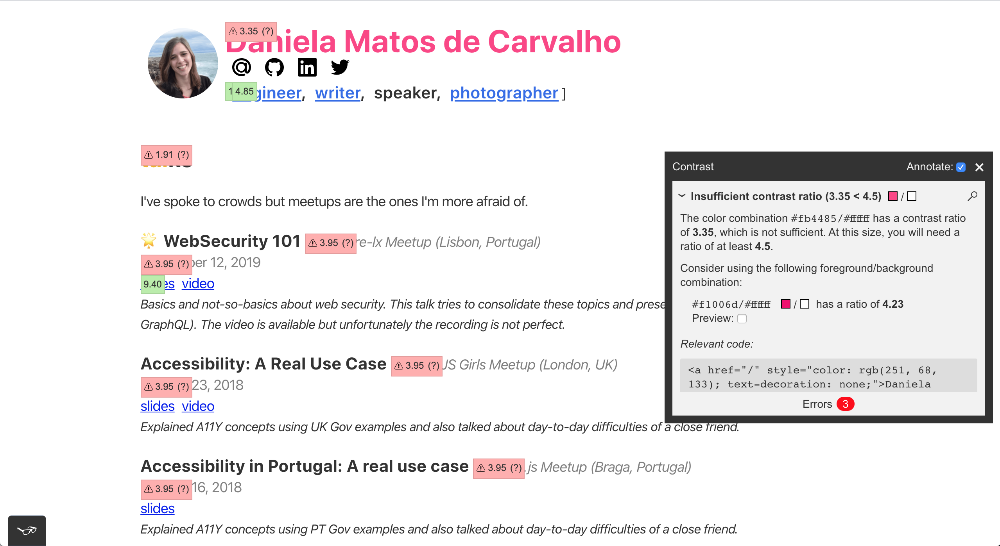
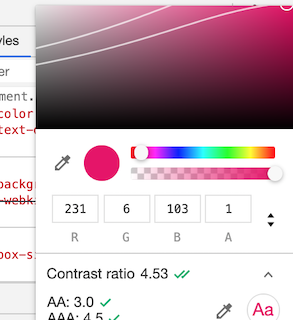
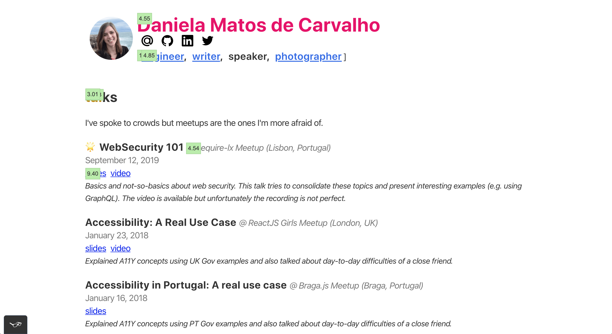
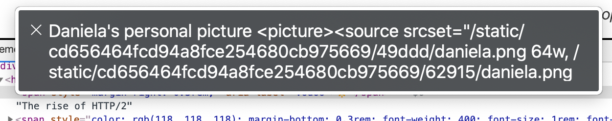
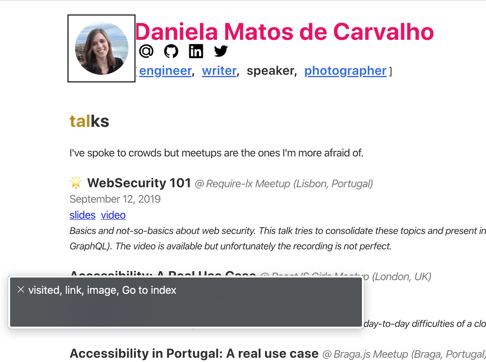
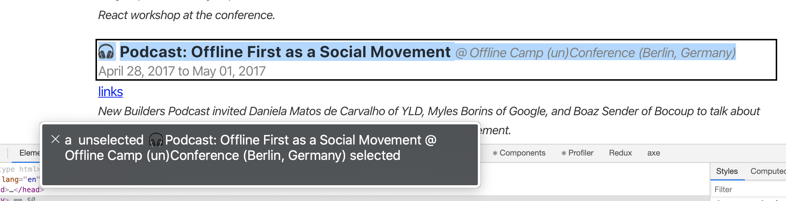
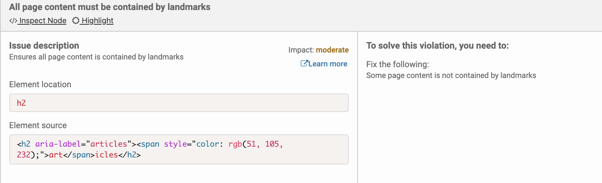
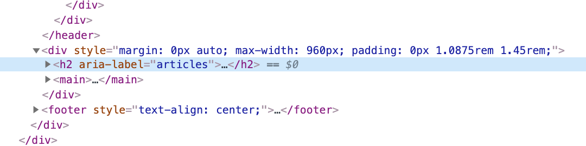
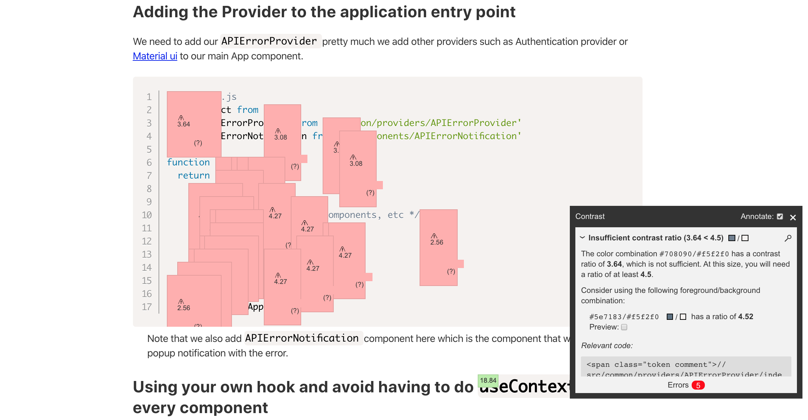

Accessibility is not an easy topic to talk about and most companies just start to think about it once they reach a large amount of users. Why? If most issues can be solved by adding extra HTML attributes, there's no reason not to educate teams not to start doing it.

When we start digging into accessibility it's important to reiterate that we're not only talking about people that are blind, but also people that are visually impaired (e.g. low vision or color blind), or even with motor/cognitive disabilities, etc. Regarding sight and namely visually impairment:

> The estimated number of people visually impaired in the world is 285 million, 39 million blind and 246 million having low vision ([World Health Organization](https://www.who.int/blindness/GLOBALDATAFINALforweb.pdf?ua=1))

This blog post tries to show the path I have taken to fix most issues on my website (and how you can do it too) and aims to create awareness of the accessibility topic and why we can't leave people behind (specially in the current COVID-19 circumstances).

### My (tiny) experience

The largest experience I have is related to a volunteer activity I do. I met a friend three years ago and he is completely blind (unfortunately we're no longer meeting in person). Being with him every week helped to understand how he interacts with the web and his phone and some difficulties that arrive quite often.

I also did a blog post on [how to educate developers about accessibility](https://sericaia.me/blog/2017-08-01/are-you-concerned-about-accessibility-how-to-educate-developers-on-creating-accessible-websites) that sums up conclusions from a brainstorming activity at [OfflineCamp conference](http://offlinefirst.org/camp/) and [a talk with an interesting use case](https://sericaia.me/talks/), but apparently there is still a lot to learn!

### The assessment

Ok, let's talk about the [website](https://sericaia.me). It was done in some days I had between jobs and as in every other project there was not a lot of time to handle accessibility properly. [Code is on Github](https://github.com/sericaia/www), feel free to check it out.

In order to assess the website I used:

- [VoiceOver](https://www.apple.com/voiceover/info/guide/_1121.html) screen reader for MacOS, which helped to understand how someone blind will hear every sentence;
- [Tota11y](https://khan.github.io/tota11y/) browser extension, that gave a lot of hints on what to change and also proposes resolutions for some problems. **If you can only choose one to install and try out, I would pick this one!**;
- [NoCoffee](https://chrome.google.com/webstore/detail/nocoffee/jjeeggmbnhckmgdhmgdckeigabjfbddl) browser extension, that simulates sight issues such as blur or cloudiness;
- [axe](https://chrome.google.com/webstore/detail/axe-web-accessibility-tes/lhdoppojpmngadmnindnejefpokejbdd) browser extension, mainly to check if it could find something that previous extensions didn't.

Let's take a look!

### What was expected

[sericaia.me](https://sericaia.me) is a pretty basic website that hosts mainly blog posts (text and images) and links to external presentations. Apparently it does not do anything special and does not have a lot of styled components (and also does not have [styled-components](https://styled-components.com/) yet because I was too lazy to add it!).

So what I really expected was:

> A clean and readable website that uses appropriate landmarks (header, footer, main), where headings (h1, h2, ...) are respected and where all article images had `alt` attribute. (myself, 3 weeks ago)

### What wasn't expected

#### Contrast issues

There are several things that can be improved in the website that can block visually impaired people from understanding the website content. Tota11y extension allows to quickly check those contrast issues so this was actually one of the first tests done:

In the following image it is possible to see in red which values are not compliant:


The problems found were mainly in the header (my name "Daniela Matos de Carvalho" uses a too light pink color), in the article/talks dates and locations (in grey). The title of the section ("talks") also had low contrast.

In order to fix the issues mentioned I used hints given by the extension but also looked into Chrome developer tools and inspected the HTML element style (Firefox has similar tools for this). In the image you can see the color information for the website title and two white lines:



The browser checks the color of the text and its background color (in this case the background is white). If you go below the two lines the contrast information will show a score greater than 4.5 and every type of text should be fine.

This is how the page looks after changing all contrast issues:



In the end there were colors that changed a bit, but the overall experience was improved:


#### Avatar

Eventually I decided to test the website with a screen reader. There is an image of myself on the website header (the avatar). It is the first thing that is read my the screen reader and a great example why we should test accessibility:



Yes, the weird characters after "Daniela's personal picture" are read and you can only 100% understand how annoying they are by [trying it out](https://www.apple.com/voiceover/info/guide/_1121.html)!

The JSX code to render the avatar is the following:

```js
import React from 'react'
import Img from 'gatsby-image'

const Avatar = ({ src }) => 

export default Avatar
```

This is read by a screen reader with a lot of not-that-interesting HTML. Why?

I decided to inspect what was actually created under the hood and I even thought it could have been a bug in the `gatsby-image`, since it (apparently) was not using the `alt` attribute that was set. But it was something else!

I eventually remembered that the image is clickable and in fact the wrapper `Link` component was breaking it! Behind the scenes the `Link` component from `gatsby` is just an HTML anchor and the label has to be on that element. Adding an `aria-label` on that element fixed the issue.

```js
// Header.js
<Link to="/" aria-label="Go to index">
  <Avatar src={/*...*/} />
</Link>
```

And now a screen reader can read this as the following:



This makes sense as this is actually an anchor (but maybe it shouldn't.). If it wasn't an anchor using the `alt` attribute would be perfectly fine and read correctly.

#### "art icles" or "articles"?

If you notice the website has these "fancy titles" with two colors for each navigation section. The component rendered is just a heading with a `span` to change the color of the first letters.

```js
const FancyTitle = ({ title, color = 'blue', lettersNumber = 3 }) => {
  const firstTextToken = title.substring(0, lettersNumber)
  const lastTextToken = title.substring(lettersNumber)

  return (
    <h2>
      <span style={{ color: colors[color] }}>{firstTextToken}</span>
      {lastTextToken}
    </h2>
  )
}
```

The problem with this is that a screen reader will read that as two different words. Let's try with "articles", which first three letters are blue and the rest is black. It will be read as "art" "ticles", two different words!

The fix for that is simply adding an `aria-label` attribute in the parent component:

```js
  // ...

  return (
    <h2 aria-label={title}>
      <span style={{ color: colors[color] }}>{firstTextToken}</span>
      {lastTextToken}
    </h2>
  )
}
```

#### The strange case of icons (and not only)

The following image shows how "Podcast: Offline First as a Social Movement @ Offline Camp (un)Conference (Berlin, Germany)" is actually read.



<!--  -->

What is correct:

1. "@" is read as "at" which it is fine.
2. "(un)Conference" is read like if it had a space between "un" and "conference". I thought if it was correct or incorrect but in the end I believe the meaning is fine and understandable since this is a bit of a different conference.

However, there is one important problem:

A headphone's icon precedes the text and it is read as "headphones" which does not give much information.

<div style="text-align:center;">
  <audio
    controls
    src="./assets/20200608_making-my-website-accessible/headphones-offline-first.mp3">
    Your browser does not support the <code>audio</code> element.
  </audio>
</div>

In order to fix this there were two options:

1. Prevent icons from being read. This can be done by adding the `aria-hidden='true'` attribute to the HTML element.
2. Add a relevant meaning to them (a meaningful `aria-label`). For example, I use icons to highlight some blog posts and one option could be to tell the screen reader to read "highlight post" before every item in the list that has a star icon.

I went for the first solution as I believe icons don't add that much and can be a distraction (and another point of failure) for screen readers.

However, I tested the second approach with the screen reader and unfortunately I was not getting the information I wanted to be read. That led me to think why [GOV.UK has a team behind accessibility](https://www.gov.uk/help/accessibility-statement) and why changes carry continuous testing.

This was what I was trying to do:

```js
// don't do this!
<>
  <span id="please-read-this" style={{ display: 'none' }}>
    Please read this
  </span>
  <span
    key={icon}
    style={{ marginRight: '0.3rem' }}
    aria-labelledby="please-read-this"
  >
    {iconToEmoji[icon]}
  </span>
</>
```

What I was trying to do here: initially I added an `aria-label` to the span with the emoji. It was not working so I decided to try to add an invisible text (hence the other span with CSS to hide it) and mark the emoji as labelled by (`aria-labelledby`) the ID of the previous.

Even though Tota11y extension has a preview of what a screen reader would read and that seemed correct, it was not being read by VoiceOver. I eventually decided that it was time to stop playing around and **read the docs!**

> "Don't use aria-label or aria-labelledby on a span or div unless its given a role." [Using ARIA](https://www.w3.org/TR/using-aria/#label-support)

> "aria-describedby on a span or div will be ignored by NVDA and VoiceOver unless given an interactive role, an image or landmark role. JAWS and Talkback are OK." [Using ARIA](https://www.w3.org/TR/using-aria/#label-support)

Ok, it is clear now why it was not working since the role attribute was missing on the previous snippet.

#### Landmarks

Landmarks are extremely important to help with navigation through a screen reader (or even with keyboard navigation). These days screen readers allow users to search under links, under landmarks, etc to help them navigate more efficiently.

Even though the website has some [landmarks](https://dequeuniversity.com/rules/axe/3.5/region?application=AxeChrome) in place (`<main>`, `<header>`, `<footer>`) with this assessment I noticed that the navigation landmark (`<nav>`) was missing. The fix was simple as changing the wrapper HTML element of the navigation (a `div`) to be a `nav`.

Another rule is that everything that is not part of the header, footer or navigation but is inside the page body should be inside `<main>`. I'm not sure why but as I moved React components around I accidentally placed the `FancyTitle` outside it. This is also something easy to fix and helps a lot someone using a screen reader: if the person jumps directly to `main` and starts reading its content without the context of what section it is, it is easy to get lost.



Checking the HTML helps to confirm that it was wrong:



It is simple to put in place the accessibility basics but it is also simple to break them. There are multiple tools out there now, let's use them (check last section on this article).

#### Date is not a heading!

Articles and talks have a date and they were added as heading, which is incorrect. As most people that fall on this trap it was done in order to get some styling for free. Changing dates to be paragraphs (`p`) and adding some styles made the appearance to be the same as before and didn't confuse screen readers.

### What to fix next

#### Code snippets

It took me a while to select the best theme for code snippets on the website. I didn't want to add one that was not in conformance with the rest of the (minimalist) design of the website but at the same time I didn't have the time to create my own theme.

The following image shows Tota11y results for contrast in one code snippet.



This is quite critical since most of the blog posts in the website have code examples. The options are (1) search for a new theme or (2) adapt the theme used.

#### Images in photography section

The photography section does not have a lot of pictures yet. However, they are currently using a flaky `alt` attribute (the file name). In the future I plan to fix that adding a more descriptive value to the images.

### Conclusion

I thought I had accessibility in mind but doing this assessment helped to identify things to be fixed. I had some interesting learnings that will help people to navigate more easily.

The two quick wins I would recommend everyone to fix in their personal or professional projects are:

- Contrasts, particularly relevant for visually impaired people;
- Using the right HTML elements, that held people that rely on assistive technologies to read content but also helps any other person to jump between elements (e.g. I've seen a lot of code creating buttons that are not `button` elements).

I also felt that clues which are interesting from a design perspective can be really confusing for someone that relies on a screen reader only and using icons are a great example of that.

I thought I had most things right and I ended up fixing a lot, let's make it part of our day to day job when coding and code reviewing.

### Resources

#### To read more

- [W3C's documentation on accessibility](https://www.w3.org/TR/using-aria)
- [Mozilla's documentation on accessibility](https://developer.mozilla.org/en-US/docs/Web/Accessibility/ARIA)
- [The A11Y Project](https://a11yproject.com)
- [GOV.UK design system](https://design-system.service.gov.uk/accessibility/)

#### To use when coding

- [webhint](https://webhint.io/) gives the same hints axe extension gives but you can use it with your IDE and see them while you're coding. It has an extension for VS Code, but there is also a CLI you can use.
- [eslint-plugin-jsx-a11y](https://github.com/jsx-eslint/eslint-plugin-jsx-a11y) is also a great plugin to add to your linter configuration.
